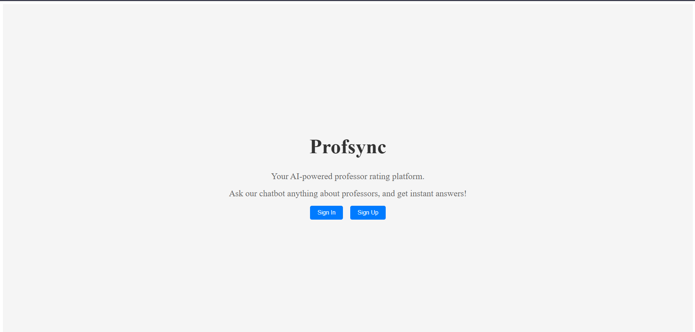
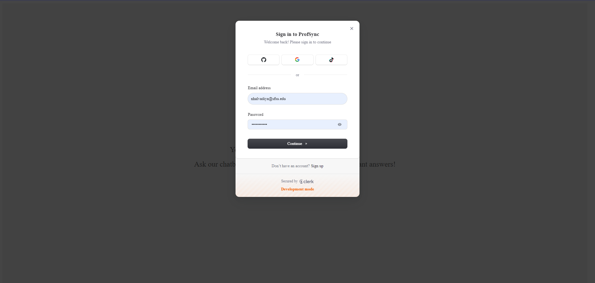
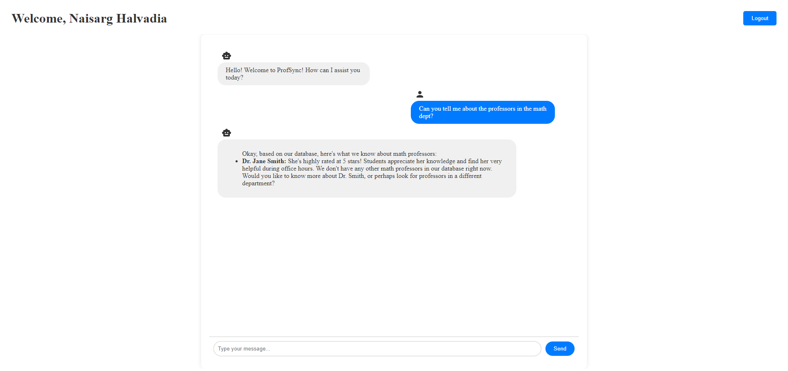
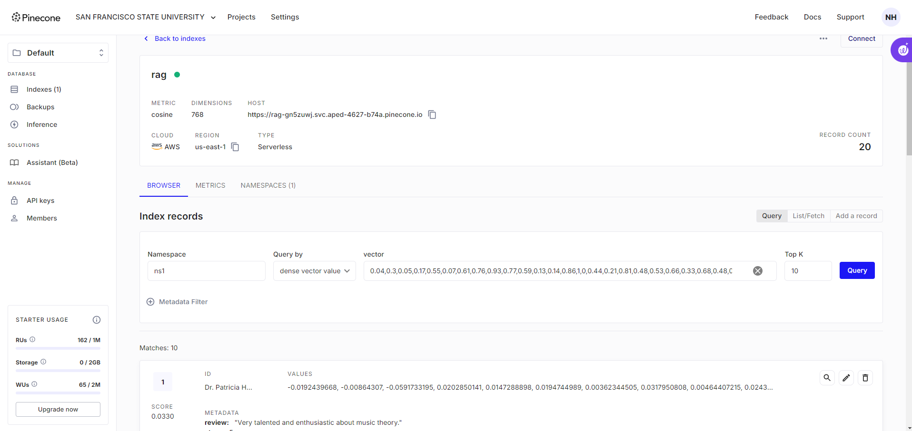

# ProfSync

ProfSync is a web application designed to help students rate and review professors using the power of Large Language Models (LLM) combined with Retrieval-Augmented Generation (RAG). It enables seamless user authentication through Clerk, integrates Gemini API for generating professor insights, and stores vectorized data in Pinecone for efficient retrieval. ProfSync uses various APIs to facilitate these integrations, creating a smart and interactive platform for student reviews.

## Features

- **User Authentication**: Integrated with [Clerk API](https://clerk.dev/) for secure login and sign-up functionality.
- **LLM + RAG Integration**: Uses a combination of LLM and Retrieval-Augmented Generation (RAG) to generate professor insights and analysis.
- **Vectorized Data Storage**: Stores vectorized professor data in [Pinecone](https://www.pinecone.io/) for fast, scalable search and retrieval.
- **Customizable Prompts**: You can modify the prompts used to generate professor insights by editing the `gemini.js` file.
- **API-Based Integrations**: ProfSync uses an API-based architecture for all external service integrations.

## Screenshots









## Tech Stack

- **Frontend**: React.js
- **User Authentication**: Clerk API
- **LLM and RAG**: Gemini API
- **Vector Data Storage**: Pinecone

## Installation

To get a local copy up and running, follow these simple steps.

### Prerequisites

Make sure you have the following installed:

- [Node.js](https://nodejs.org/) (v14 or higher)
- [npm](https://www.npmjs.com/get-npm)

### Setup

1. Clone the repository:

   ```bash
   git clone https://github.com/nh0397/ProfSync
   cd ProfSync
   ```
2. Install dependencies:
    ```
    npm install
    ```
3. Set up environment variables:

    Create a .env file in the root directory of the project and add the following:
    ```
    REACT_APP_GOOGLE_API_KEY=your-google-api-key
    REACT_APP_PINECONE_API_KEY=your-pinecone-api-key
    REACT_APP_CLERK_PUBLISHABLE_KEY=your-clerk-publishable-key
    CLERK_SECRET_KEY=your-clerk-secret-key
    REACT_APP_PINECONE_INDEX_NAME=rag
    REACT_APP_PINECONE_ENVIRONMENT=us-east-1
    REACT_APP_API_URL=your-api-url
    ```
- You can get your Clerk publishable key from the [Clerk API dashboard](https://dashboard.clerk.com/apps/).
- The Firebase API key is required for additional integrations (e.g., user analytics or database usage).


### Running the App
To start the development server, run:
```
npm start
```
The app will be available at http://localhost:3000.

Backend of the app: https://github.com/nh0397/ProfSync-Backend

### Learn More
- Clerk API Documentation: https://clerk.dev/docs
- Pinecone API Documentation: https://docs.pinecone.io/home
- Gemini API Documentation: https://ai.google.dev/gemini-api/docs

### Contributing
Contributions are welcome! Please follow these steps to contribute:

- Fork the repository.
- Create your feature branch: git checkout -b feature/YourFeature.
- Commit your changes: git commit -m 'Add some feature'.
- Push to the branch: git push origin feature/YourFeature.
- Open a pull request.